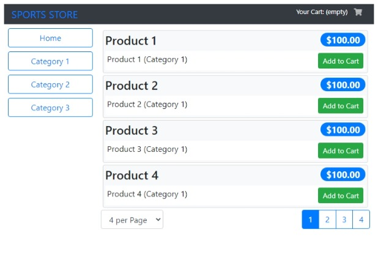

# Angular SportsStore

[![angular-sportsstore-ci][ci-badge]][ci-workflow]

Based on the application built in chapters 7-10 in the book 'Pro Angular 9' by Adam Freeman (Apress, 2020).

SportsStore is an online product catalog that customers can browse by category and page, a shopping cart
where users can add and remove products, and a checkout where customers can enter their shipping details
and place their orders.

>The focus is on Angular, of course, and so the integration with external systems, have been
simplified such as the data store, and omitted others entirely, such as payment processing.

This project was generated with Angular CLI version 9.0.3.

**DEMO**: <https://feliperomero3.github.io/angular-sportsstore/>

## Prerequisites

- Node.js 12.x
- Angular CLI 9.x

## Build

Run `ng build` to build the project. The build artifacts will be stored in the `dist/` directory.

## Run

Run `ng serve` for a dev server. Navigate to `http://localhost:4200/`.

## Running unit tests

Run `ng test` to execute the unit tests via Karma.

## Running e2e tests

Run `ng e2e` to execute the e2e tests via Protractor.

## Screen captures

## License

[MIT License](./LICENSE)

Copyright (c) 2021 Felipe Romero

[ci-badge]: https://github.com/feliperomero3/angular-sportsstore/actions/workflows/angular-sportsstore-ci.yml/badge.svg
[ci-workflow]: https://github.com/feliperomero3/angular-sportsstore/actions/workflows/angular-sportsstore-ci.yml
