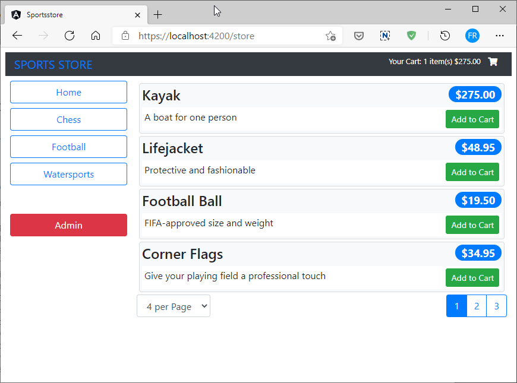

# Angular SportsStore

[![angular-sportsstore-ci][ci-badge]][ci-workflow]

Based on the application built in chapters 7-10 in the book 'Pro Angular 9' by Adam Freeman (Apress, 2020).

SportsStore is an online product catalog that customers can browse by category and page, a shopping cart
where users can add and remove products, and a checkout where customers can enter their shipping details
and place their orders.

>The focus is on Angular, of course, and so the integration with external systems, have been
simplified such as the data store, and omitted others entirely, such as payment processing.

This project was generated with Angular CLI version 9.0.3.

**DEMO**: <https://feliperomero3.github.io/angular-sportsstore/>

## Prerequisites

- Node.js 12.x
- Angular CLI 9.x

## Getting started

1. Clone the project.
2. Open a terminal in the root directory and execute `npm run json` to start the local json-server.
3. Open a second terminal and execute `npm run build` and then `npm run start` to build and start the application respectively.
4. Navigate to `http://localhost:4200/`.

This project has following npm scripts:

- `npm run start` starts the app locally on default port (4200).
- `npm run test` runs the unit tests.
- `npm run e2e` runs end to end tests (you need to run `npm run json` first).
- `npm run e2e-ci` runs `start-server-and-test` to start an instance of `json-server` and then runs the end to end tests (this script is used on the CI server).

## Tests

Tests are done using Jasmine and Karma; Protractor is used for e2e tests.

To run tests use the npm script `npm run test`.
To run end to end tests use `npm run e2e` (you need to run `npm run json` first).

## Screen captures

## License

[MIT License](./LICENSE)

Copyright (c) 2021 Felipe Romero

[ci-badge]: https://github.com/feliperomero3/angular-sportsstore/actions/workflows/angular-sportsstore-ci.yml/badge.svg
[ci-workflow]: https://github.com/feliperomero3/angular-sportsstore/actions/workflows/angular-sportsstore-ci.yml
